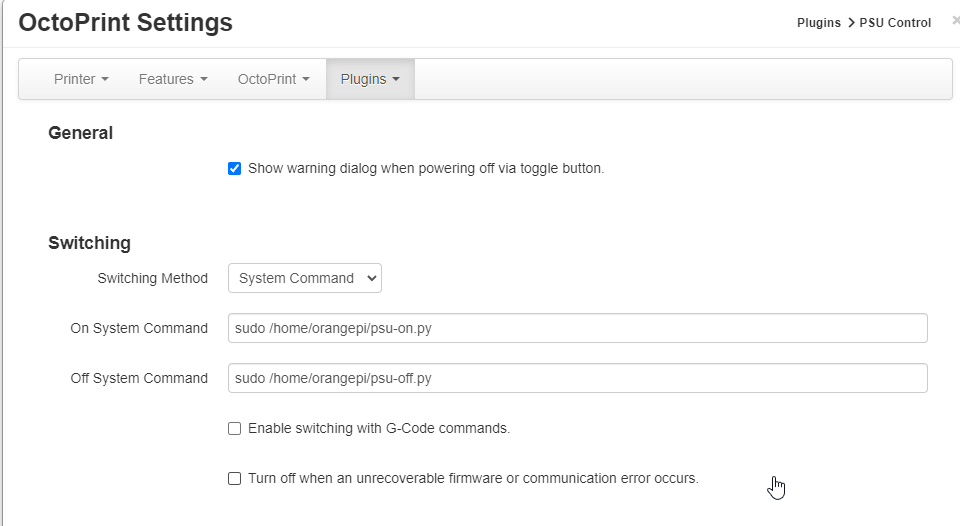

# OPiZ2PSUControl
Orange Pi Zero 2 PSU Control for Octoprint

This is a 5 minute solution to enable an Orange Pi Zero 2 to use GPIO pins to operate an IOT PDU.

Install:

Install a copy of OPI.GPIO, I opted for this Python3 compatible version: https://github.com/NadavK/OPI.GPIO
(only deviation I had was installing python3-dev instead of python-dev)

Copy psu-on.py and psu-off.py into the home directory of the user.

Allow the orangepi (or any user) to execute the scripts without a password, through sudo

> visudo

...
orangepi ALL = NOPASSWD: /home/orangepi/psu-on.py
orangepi ALL = NOPASSWD: /home/orangepi/psu-off.py
...

Test that the user can run 'sudo /home/orangepi/psu-on.py'

Connect the PDU to the Orange Pi Zero 2 using pins 3 and 6.

Install the PSU Control in Octoprint.

Configure Octoprint's PSU Control plugin to use 'System Command' as the switching mechanism i.e.

...
On System Command: sudo /home/orangepi/psu-on.py
Off System Command: sudo /home/orangepi/psu-off.py
...

