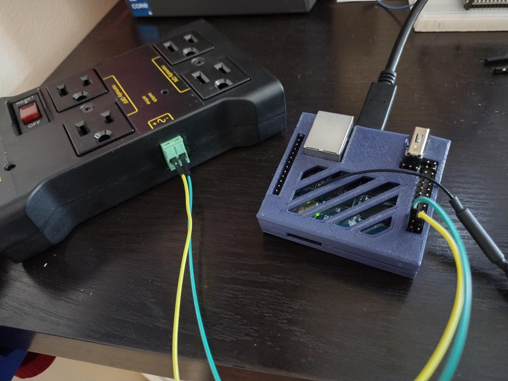
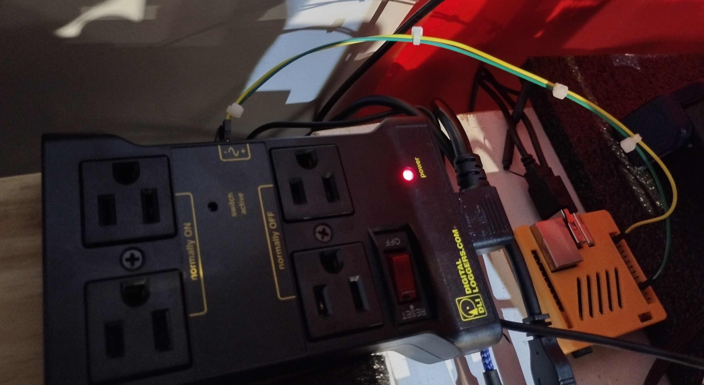
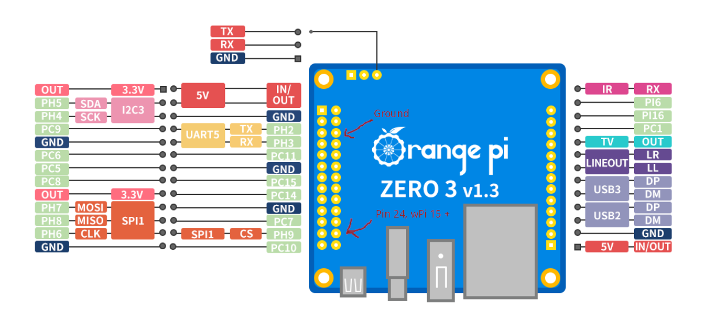
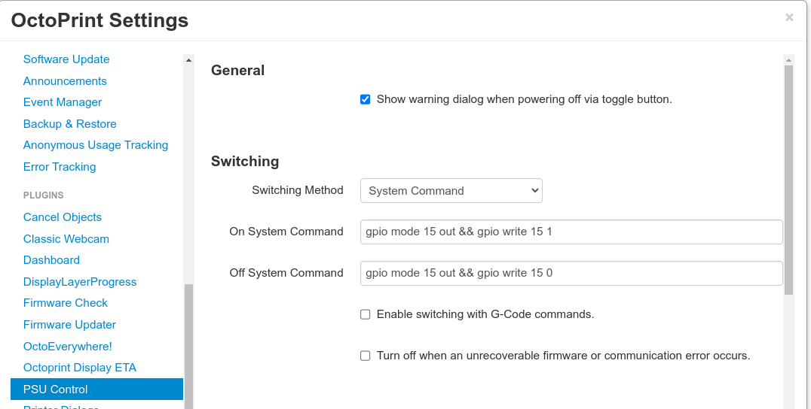

# Orange Pi 2 or 3 with Octoprint
Orange Pi Zero 2 PSU Control for Octoprint's PSU Control plugin to power on printers.

## Orange Pi Zero 2

This is a simple solution to enable an Orange Pi Zero 2 to use GPIO pins to operate an IOT PDU within Octoprint.  This howto should also work with RPI.GPIO, with minor modification to the scripts. I used one of these IOT PDUs from Digital Loggers:

### Install software on OPIZ2:

Install a copy of OPI.GPIO, I opted for this Python3 compatible version: https://github.com/NadavK/OPI.GPIO
(only deviation I had was installing python3-dev instead of python-dev)

Copy psu-on.py and psu-off.py into the home directory of the user.  Maybe test as root to ensure the above is all in place?

### Allow the user to run the scripts
Allow the orangepi (or any user) to execute the scripts without a password, through sudo.  Append the following lines to the file.

`> visudo`

...

`orangepi ALL = NOPASSWD: /home/orangepi/psu-on.py`

`orangepi ALL = NOPASSWD: /home/orangepi/psu-off.py`

Test that the user can run 

`sudo /home/orangepi/psu-on.py`

### Wiring the OPIZ2

Connect the PDU to the Orange Pi Zero 2 using pins 3 and 6 (a GPIO and ground, respectively)

Oh, and if it wasn't obvious, plug your printer into the PDU ;)

### Install Octoprint Plugin and Configure

Install the PSU Control plugin in Octoprint.

Configure Octoprint's PSU Control plugin to use 'System Command' as the switching mechanism i.e.

`On System Command: sudo /home/orangepi/psu-on.py`

`Off System Command: sudo /home/orangepi/psu-off.py`

Screenshot below:

You may now use the 'Lightning Bolt' on the top menu of Octoprint to power the printer on and off.

## Orange Pi Zero 3

The Orange Pi Zero 3 includes a working install of WiringPi.  Run `gpio readall` from the Linux CLI to see the current pin status.

### Wiring a Zero Pi 3

Per the diagram below, I believe this translates to 'pins 6 (Ground) and 24'

### Octoprint Config

Install the plugin PDU Control within Octoprint

Configure the plugins as follows:

Each command ensures the output mode for that pin, and then writes a value, 0 for off, 1 for on.

On
`gpio mode 15 out && gpio write 15 1`

Off
`gpio mode 15 out && gpio write 15 0`

You may now use the 'Lightning Bolt' on the top menu of Octoprint to power the printer on and off.
